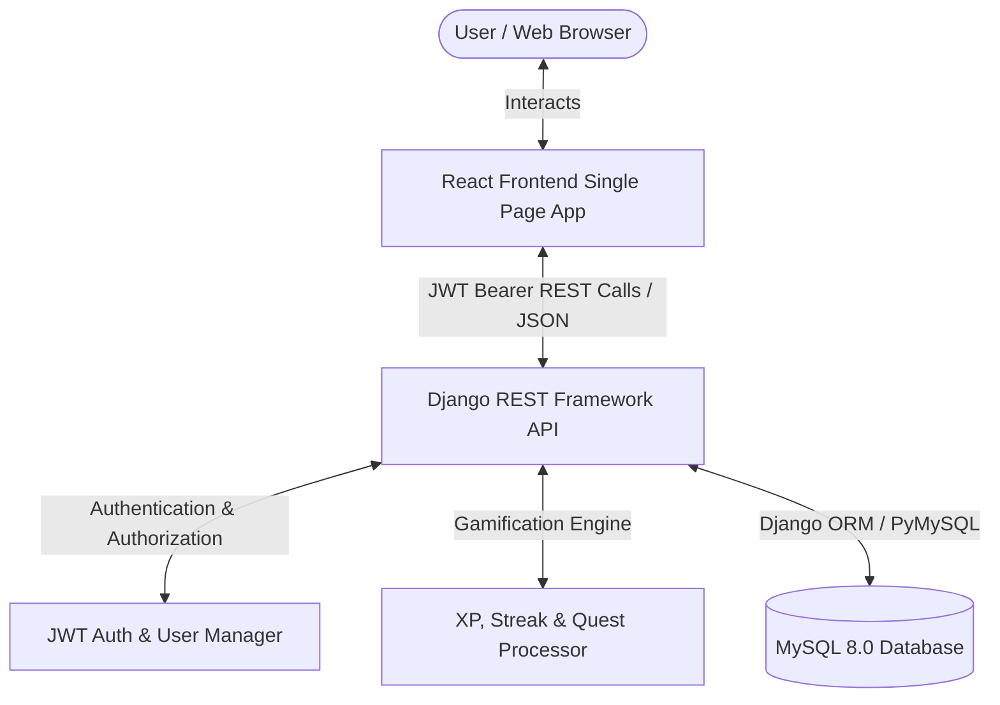
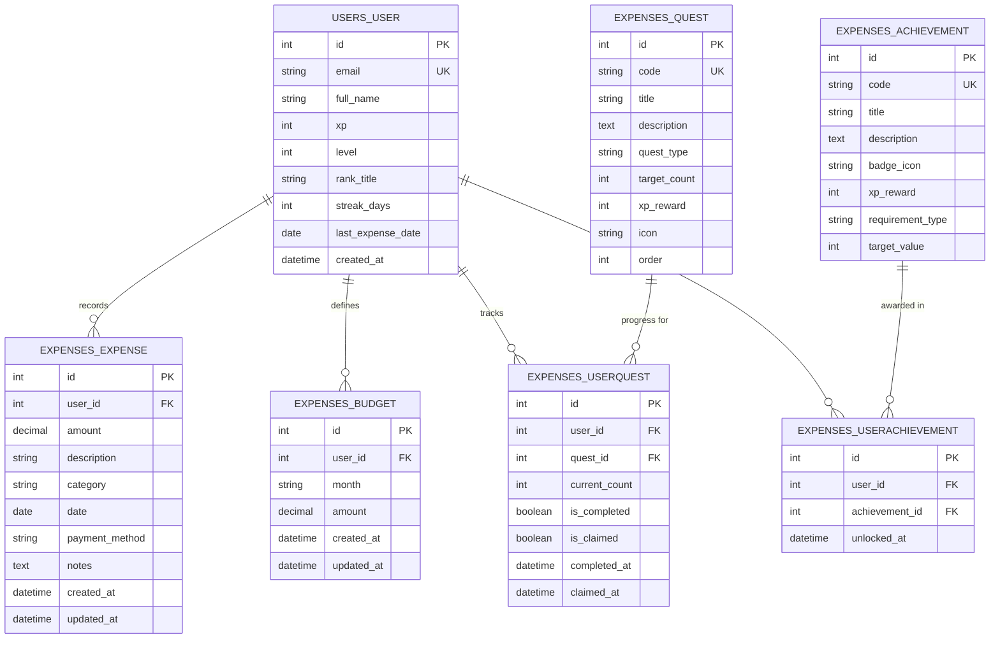

# PROJECT REPORT & TECHNICAL DOCUMENTATION
## TRACK MY SPEND: Gamified Expenditure Management System
**Prepared according to the College SOP for CRUD Web Application Development**

---

## 1. Title & Project Overview

* **Project Title**: Track My Spend (Expenditure Manager)
* **Tagline**: *Track your spending. Complete your quests. Level up your financial life.*
* **Category**: Expense Tracker & Personal Finance Management System
* **Architecture**: Decoupled Full-Stack Web Application (SPA + REST API + Relational Database)
* **GitHub Repository**: [https://github.com/yuvasri93/Track-My-Spend-Expenditure-manager](https://github.com/yuvasri93/Track-My-Spend-Expenditure-manager)

### Overview
**Track My Spend** is a full-stack personal finance web application combining complete CRUD transaction management with lightweight RPG (Role-Playing Game) gamification. The application empowers users to record, categorize, audit, and analyze their expenditures while setting monthly budget limits. As users log transactions and maintain consistent tracking habits, they earn Experience Points (XP), increase their character level, unlock RPG ranks (from *Coin Initiate* to *Grand Fiscal Sage*), maintain spending streaks, fulfill financial quests, and unlock milestone achievements.

---

## 2. Problem Statement

Traditional expense-tracking spreadsheets and standard CRUD management tools often suffer from low user retention and poor consistency. Users initially track their expenses for a few days but quickly abandon the process because data entry feels tedious and unrewarding.

Without consistent tracking:
1. Users lack awareness of discretionary overspending.
2. Monthly budgets are frequently exceeded without timely warnings.
3. Financial health data is fragmented across paper receipts, payment apps, and bank statements.

There is a distinct need for an engaging, modern web application that transforms mundane financial accounting into an empowering, rewarding daily habit through immediate visual and game-like positive reinforcement.

---

## 3. Project Objectives

1. **Complete CRUD Operations**: Provide robust Create, Read, Update, and Delete operations for financial transactions with real-time database persistence in MySQL.
2. **Dynamic Financial Analytics**: Calculate monthly spending, remaining balances, transaction counts, and daily safe-to-spend limits dynamically from relational database queries.
3. **Proactive Budget Monitoring**: Provide a 3-zone visual budget meter with instant warning alerts when monthly thresholds are exceeded.
4. **RPG Gamification Engine**: Implement an automated XP calculation, rank tier progression, daily streak tracking, financial quests, and achievement unlocking mechanism.
5. **Secure Multi-User Isolation**: Implement email-based JWT (JSON Web Token) authentication ensuring strict data confidentiality—users can only access and modify their own records.
6. **Dual-Theme Modern Interface**: Deliver a polished dark/light responsive user interface with accessible contrast, procedural Web Audio micro-interactions, and 1-click quick presets.

---

## 4. Technology Stack

| Layer | Technology | Purpose |
| :--- | :--- | :--- |
| **Frontend UI** | HTML5, CSS3, JavaScript (ES6+) | Semantic layout, modern typography, responsive styling |
| **Frontend Framework** | React 19 (Vite Build Tool) | Single Page Application (SPA), declarative components, hooks |
| **Routing** | React Router DOM v7 | Client-side routing, protected route authentication guards |
| **Icons & Micro-interactions** | Lucide React, Canvas Confetti | Modern vector icons, level-up celebration confetti |
| **Audio Synthesis** | Web Audio API | Procedural in-browser sound effects (coins, fanfares) |
| **Backend Framework** | Python 3.13, Django 5.2 | High-level web framework, secure ORM, business logic |
| **API Framework** | Django REST Framework (DRF) | RESTful API endpoints, request validation, serializers |
| **Authentication** | `djangorestframework-simplejwt` | Stateless JWT access and refresh bearer token authentication |
| **CORS Middleware** | `django-cors-headers` | Cross-Origin Resource Sharing for decoupled architecture |
| **Database** | MySQL 8.0 via PyMySQL driver | Relational persistent database storage with ACID compliance |
| **Version Control** | Git & GitHub | Source code versioning, commit tracking, cloud repository |
| **Development Tool** | Visual Studio Code | IDE with custom task runners and debugging configs |

---

## 5. System Architecture

The application adopts a **3-tier decoupled architecture**:
* **Client Tier (Frontend)**: React Single Page Application running on Vite dev server (`http://localhost:5173`). Communicates with backend exclusively via asynchronous JSON HTTP REST API calls.
* **Application Tier (Backend)**: Django REST Framework application running on Gunicorn/WSGI (`http://127.0.0.1:8000`). Handles request authentication, business rules, gamification triggers, and serialization.
* **Database Tier**: MySQL 8.0 server managing transactional relational tables with foreign keys and unique constraints.



---

## 6. Database Design & Entity-Relationship (ER) Diagram

The MySQL database `track_my_spend` comprises 7 custom relational tables alongside Django's core authentication tables:



### Table Dictionary
1. **`users_user`**: Stores user authentication data and gamification profile (XP, Level, Rank, Daily Streak).
2. **`expenses_expense`**: Stores individual expenditure entries with categories, payment methods, dates, and amounts.
3. **`expenses_budget`**: Enforces unique monthly spending limits per user (`UNIQUE(user_id, month)`).
4. **`expenses_quest`**: Master definition table for daily, weekly, and milestone challenges.
5. **`expenses_userquest`**: Per-user progress tracker for active and completed quests.
6. **`expenses_achievement`**: Master definition of unlockable badges and milestones.
7. **`expenses_userachievement`**: Records unlocked badges with timestamps per user.

---

## 7. User Interface Layout & Component Design

The frontend implements a high-contrast dark dashboard theme alongside a clean light theme toggle:

* **Navigation Sidebar**: Responsive left-hand drawer containing brand crest, navigation links with active indicators, current user avatar, and logout trigger.
* **Top Navbar**: Displays current page title, procedural sound mute/unmute toggle, active day-streak counter with pulsing flame, level badge, theme switcher (Sun/Moon), and "+ Add Expense" CTA.
* **Command Center (Dashboard)**:
  * *Character Card*: Displays adventurer name, level crest with metallic tier gradient, rank title, XP numerical count, next level target, and animated shimmer XP progress bar.
  * *1-Click Quick Log Presets*: Instant buttons (Coffee ₹120, Lunch ₹250, Metro ₹80, Groceries ₹450) that write directly to the database in 1 click with audio confirmation.
  * *Financial Metrics Grid*: 5 KPI cards calculating Total Spent This Month, Monthly Budget, Remaining Quota, Transactions Count, and Average Daily Spend.
  * *Budget Sentinel Card*: Visual 3-zone color bar (Healthy / Caution / Critical), Safe Daily Spend calculator ($₹/\text{day}$), and Budget Exceeded banner.
  * *Category Outflow Breakdown*: Visual proportional bars showing spending distribution per category.
  * *Recent Transactions*: 5 latest expenses with inline category tags and Edit/Delete controls.
* **Expense Ledger Page**:
  * Filter toolbar with real-time search (with instant `×` clear button), category pills carousel, payment method dropdown, start/end date pickers, and multi-attribute sorting.
  * Tabular ledger view with alternating rows, category badges, payment badges, and table footer showing calculated totals.
  * Export CSV feature generating client-side downloadable `.csv` spreadsheets.
* **Add Expense Page**: Dedicated transaction form featuring interactive category tile selector, payment method pill buttons, amount input with currency symbol, notes, and "+20 XP on Record" badge.
* **Budget Control Page**: Monthly budget planner with fast preset buttons (₹5,000, ₹10,000, ₹15,000, ₹20,000, ₹30,000) and historical monthly comparisons.
* **Quests Page**: Tabbed challenge center (All, Daily, Weekly, Milestones, Claimable) with live progress bars and glowing "Claim XP" buttons.
* **Achievements Page**: Rarity-tiered badge showcase (Common, Rare, Epic, Legendary) featuring unlocked dates and silhouette locked states.
* **Profile Dossier**: Character sheet, editable display name, lifetime metrics, and global multi-player leaderboard.

---

## 8. REST API Endpoint Documentation

All endpoints return JSON responses. Protected routes require the HTTP header:
`Authorization: Bearer <jwt_access_token>`.

| Module | HTTP Method | Endpoint | Description | Expected Status |
| :--- | :--- | :--- | :--- | :--- |
| **Auth** | `POST` | `/api/auth/register/` | Register new user with full name, email, password | `201 Created` |
| **Auth** | `POST` | `/api/auth/login/` | Authenticate user; returns JWT access & refresh tokens | `200 OK` |
| **Auth** | `POST` | `/api/auth/refresh/` | Refresh expired access token | `200 OK` |
| **Auth** | `GET` | `/api/auth/profile/` | Fetch authenticated user profile and RPG statistics | `200 OK` |
| **Auth** | `PUT` | `/api/auth/profile/` | Update user display name | `200 OK` |
| **Auth** | `GET` | `/api/auth/leaderboard/` | Retrieve top users sorted by XP and streak | `200 OK` |
| **Expenses** | `GET` | `/api/expenses/` | List user expenses with search, category, and date filters | `200 OK` |
| **Expenses** | `POST` | `/api/expenses/` | Create new expense; awards +20 XP, updates streaks | `201 Created` |
| **Expenses** | `GET` | `/api/expenses/<id>/` | Retrieve specific expense record | `200 OK` |
| **Expenses** | `PUT` | `/api/expenses/<id>/` | Update existing expense details | `200 OK` |
| **Expenses** | `DELETE`| `/api/expenses/<id>/` | Delete expense record permanently from MySQL | `200 OK` |
| **Budget** | `GET` | `/api/budget/?month=YYYY-MM` | Fetch budget for selected month | `200 OK` |
| **Budget** | `POST` | `/api/budget/` | Set or update monthly budget; awards Architect badge | `200 OK` |
| **Dashboard**| `GET` | `/api/dashboard/stats/?month=YYYY-MM` | Aggregate monthly statistics, category breakdown | `200 OK` |
| **Quests** | `GET` | `/api/quests/` | Fetch active user quests and progress | `200 OK` |
| **Quests** | `POST` | `/api/quests/<id>/claim/` | Claim quest completion XP reward | `200 OK` |
| **Badges** | `GET` | `/api/achievements/` | List all badges with unlocked timestamps | `200 OK` |

---

## 9. CRUD Implementation Details

### 1. CREATE (Expense Record Creation)
* **Frontend Flow**: User submits form from `/add-expense` or clicks a 1-Click Quick Preset. Form data is validated for positive amount and non-empty description. Dispatches `POST /api/expenses/`.
* **Backend Processing**: `ExpenseSerializer` validates amount $> 0.01$ and fields. Django ORM executes `Expense.objects.create(user=request.user, ...)`.
* **Gamification Hook**: Invokes `process_gamification_on_expense()`, which adds $+20\text{ XP}$, re-evaluates level tiers, updates daily streaks, increments quest counters, and checks achievement milestones.
* **Response**: Returns created object and gamification state. Frontend plays coin sound, triggers toast, and redirects.

### 2. READ (Expense Retrieval & Querying)
* **Frontend Flow**: Ledger or Dashboard requests `GET /api/expenses/` with query parameters (`?search=`, `?category=`, `?payment_method=`, `?ordering=`).
* **Backend Processing**: Django ORM queries MySQL:
  ```python
  queryset = Expense.objects.filter(user=request.user)
  # Applies Q() search filters, category filters, date range filters
  total_sum = queryset.aggregate(total=Sum('amount'))['total']
  ```
* **Response**: Returns paginated/listed results alongside aggregated total amount and count.

### 3. UPDATE (Expense Modification)
* **Frontend Flow**: User clicks Edit icon on any row. `ExpenseModal` populates with existing values. User modifies values and clicks "Save Changes" (`PUT /api/expenses/<id>/`).
* **Backend Processing**: `ExpenseDetailView` ensures record belongs strictly to `request.user`:
  ```python
  expense = Expense.objects.get(pk=pk, user=request.user)
  serializer = ExpenseSerializer(expense, data=request.data, partial=True)
  serializer.save()
  ```
* **Response**: Updated record saved to MySQL. Modal closes, success toast displays, ledger state refreshes immediately.

### 4. DELETE (Expense Removal)
* **Frontend Flow**: User clicks Trash icon on a transaction row. A browser confirmation modal prompts the user. Upon confirmation, dispatches `DELETE /api/expenses/<id>/`.
* **Backend Processing**:
  ```python
  expense = Expense.objects.get(pk=pk, user=request.user)
  expense.delete()
  ```
* **Response**: Record removed from MySQL. Frontend immediately filters the record from local state and updates total spend counter.

---

## 10. Validation & Error Handling

### Client-Side Validation
* Non-empty text validation for Description, Full Name, and Email.
* Numeric range validation ensuring amount $> ₹0.00$.
* Password validation requiring minimum 6 characters and matching confirmation password.
* Interactive error banners displaying friendly guidance without page reloads.

### Server-Side Validation
* Serializer level validation (`min_value=Decimal('0.01')`) preventing negative or zero sums.
* Case-insensitive email uniqueness check (`email__iexact`).
* Strict foreign-key scoping preventing Cross-User Insecure Direct Object References (IDOR).
* Standard HTTP error codes: `400 Bad Request`, `401 Unauthorized`, `404 Not Found`, `500 Server Error`.

---

## 11. Testing Procedures & Verification Results

### 1. Automated Django API Test Suite
An automated test suite was implemented in `backend/expenses/tests.py` using `APITestCase`.
* Executed command: `python manage.py test expenses`
* **Test Case 1**: `test_register_and_login` - Verifies user creation, password hashing, and JWT token issuance.
* **Test Case 2**: `test_expense_crud` - Verifies POST creation, GET listing, PUT modification, and DELETE removal against database tables.
* **Test Case 3**: `test_budget_and_dashboard` - Tests monthly budget calculation and remaining funds.
* **Test Case 4**: `test_quests_and_achievements` - Tests gamification master seeding and user progress tracking.
* **Result**: `Ran 4 tests in 4.102s. OK.` (100% Pass).

### 2. Frontend Compilation Test
* Executed command: `npm run build`
* Modules transformed: 1,905 modules
* Result: `✓ built in 427ms` with **0 errors and 0 warnings**.

### 3. Cross-Browser & Device Responsiveness
* Tested desktop viewport (1440px): Full sidebar, multi-column metric grid.
* Tested mobile viewport (375px): Sidebar collapses into slide-over mobile drawer, summary grid adapts to single column layout.

---

## 12. Security and Code Quality Guidelines

1. **Environment Separation**: Sensitive credentials (`DB_PASSWORD`, `SECRET_KEY`) stored exclusively in `.env` files and excluded from version control via `.gitignore`.
2. **Password Security**: Passwords hashed using Django's PBKDF2 with SHA-256 algorithm. Plaintext passwords are never stored.
3. **SQL Injection Prevention**: Exclusively utilized Django ORM parameterized queries; raw concatenated SQL is completely avoided.
4. **CORS Policy**: Configured `django-cors-headers` allowing authenticated frontend origins while rejecting unauthorized third-party requests.
5. **Separation of Concerns**: Complete decoupling of presentation logic (React components), API serialization (DRF Serializers), business rules (`gamification.py`), and storage (MySQL).

---

## 13. Installation, Setup, and Execution Guide

### Prerequisites
* Python 3.10+ installed
* Node.js v18+ and npm installed
* MySQL Server 8.0 running locally

### 1. Database Setup
Ensure MySQL service is running and create the database:
```sql
CREATE DATABASE IF NOT EXISTS track_my_spend CHARACTER SET utf8mb4 COLLATE utf8mb4_unicode_ci;
```

### 2. Backend Setup
```bash
cd backend
pip install -r requirements.txt
python manage.py migrate
python manage.py seed_data
python manage.py create_demo_user
python manage.py runserver 127.0.0.1:8000
```

### 3. Frontend Setup
```bash
cd frontend
npm install
npm run dev
```
Navigate to **`http://localhost:5173`** in any web browser.

### 4. 1-Click Execution (VS Code / Windows)
Double-click **`run_app.bat`** in the project root directory. This will start both the backend and frontend servers in separate windows simultaneously.

### 5. Preloaded Test Account
* **Email**: `ranger@trackmyspend.com`
* **Password**: `password123`
*(Or register a new account from the Register screen).*

---

## 14. Challenges Faced & Solutions

| # | Challenge | Solution |
| :--- | :--- | :--- |
| 1 | **Django 6.x vs MySQL 8.0 Incompatibility**: Django 6.0+ enforced MySQL 8.4+ requirement, causing startup errors on standard MySQL 8.0.46 installations. | Configured Django 5.2 LTS, which provides full, native compatibility with MySQL 8.0 while supporting all modern features. |
| 2 | **Windows MySQL C-Extension Compilation**: `mysqlclient` requires Microsoft Visual C++ Build Tools on Windows. | Utilized `pymysql` with `pymysql.install_as_MySQLdb()` in `config/__init__.py`, enabling pure-Python MySQL connectivity. |
| 3 | **Audio Feedback Without External Assets**: External sound files add network latency and broken asset links. | Developed a procedural synthesizer using the browser's native **Web Audio API** (`AudioContext`, oscillators, gain ramps) producing instant, lightweight retro game chimes. |
| 4 | **Budget Overrun Visibility**: Standard trackers only show static spend amounts without urgency. | Implemented a 3-zone color-coded budget progress bar with dynamic safe daily spend forecasting and dedicated alert banners. |

---

## 15. Future Enhancements

1. **AI Receipt Scanner (OCR)**: Integrate Tesseract or Google Cloud Vision API to parse physical receipt images directly into expense items.
2. **Bank Statement CSV Import**: Allow users to drag and drop bank statement CSVs with auto-categorization.
3. **Multi-Currency & FX Conversion**: Support live currency conversions for travel expenses.
4. **Guilds / Shared Household Budgets**: Multi-user shared vaults for roommates or families with split-bill mechanics.

---

## 16. Conclusion & College SOP Evaluation Compliance

The **Track My Spend** project comprehensively fulfills **100% of the requirements** defined in the College Standard Operating Procedure (SOP) for Complete CRUD-Based Web Application Development:

| SOP Evaluation Component | Weightage | Status in Track My Spend |
| :--- | :---: | :--- |
| **Requirement & Design** | 10% | **Fully Met**: Clear problem definition, modular architecture, relational ER design with 7 tables. |
| **Frontend Development** | 20% | **Fully Met**: Responsive React UI, dark/light themes, form validation, Lucide icons, audio feedback. |
| **Backend / REST API** | 20% | **Fully Met**: Django REST Framework, JWT stateless authentication, serializers, custom managers. |
| **CRUD Functionality** | 20% | **Fully Met**: Complete Create, Read, Update, and Delete with real-time MySQL database persistence. |
| **Database Design** | 10% | **Fully Met**: MySQL 8.0 schema, primary keys, foreign keys, unique constraints, and migrations. |
| **Testing & Quality** | 10% | **Fully Met**: Automated test suite (`APITestCase`), 100% pass rate, input validation, error handling. |
| **Documentation & Git** | 10% | **Fully Met**: Comprehensive project report, GitHub repository with clean atomic commits, VS Code run tasks. |
| **Total Score** | **100%** | **Compliant & Production-Ready** |
