# PROJECT REPORT
## TRACK MY SPEND

*Track your spending. Complete your quests. Level up your financial life.*

**Gamified Expenditure Management System**
Prepared according to the College SOP for CRUD Web Application Development

---

**Name:** YUVASRI A

**Register Number:** 922525104189

**Department:** COMPUTER SCIENCE AND ENGINEERING

**College:** V S B ENGINEERING COLLEGE KARUR

**Academic Year:** 2025-2029

## Table of Contents

1. [Title & Project Overview](#1-title--project-overview)
2. [Problem Statement](#2-problem-statement)
3. [Project Objectives](#3-project-objectives)
4. [Technology Stack](#4-technology-stack)
5. [System Architecture](#5-system-architecture)
6. [Database Design & ER Diagram](#6-database-design--er-diagram)
7. [User Interface Layout & Screenshots](#7-user-interface-layout--screenshots)
8. [REST API Endpoint Documentation](#8-rest-api-endpoint-documentation)
9. [CRUD Implementation Details](#9-crud-implementation-details)
10. [Validation, Testing & Results](#10-validation-testing--results)
11. [Security & Code Quality Guidelines](#11-security--code-quality-guidelines)
12. [Installation, Setup & Execution Guide](#12-installation-setup--execution-guide)
13. [Challenges Faced & Solutions](#13-challenges-faced--solutions)
14. [Future Enhancements](#14-future-enhancements)
15. [Conclusion & College SOP Evaluation Compliance](#15-conclusion--college-sop-evaluation-compliance)
16. [Git Repository & Reference Details](#16-git-repository--reference-details)

---

## 1. Title & Project Overview

- **Project Title:** Track My Spend (Expenditure Manager)
- **Tagline:** *Track your spending. Complete your quests. Level up your financial life.*
- **Category:** Expense Tracker & Personal Finance Management System
- **Architecture:** Decoupled full-stack web application (SPA front end + REST API back end + relational database)

Track My Spend is a full-stack personal finance web application that combines complete CRUD transaction management with lightweight RPG (role-playing game) gamification. The application empowers users to record, categorise, audit and analyse their expenditure while setting monthly budget limits. As users log transactions and keep up consistent tracking habits, they earn Experience Points (XP), increase their character level, unlock RPG ranks (from *Coin Initiate* to *Grand Fiscal Sage*), maintain spending streaks, fulfil financial quests and unlock milestone achievements.

**Git Repository:** https://github.com/yuvasri93/Track-My-Spend-Expenditure-manager

---

## 2. Problem Statement

Traditional expense-tracking spreadsheets and standard CRUD management tools often suffer from low user retention and poor consistency. Users initially track their expenses for a few days but quickly abandon the process because data entry feels tedious and unrewarding.

Without consistent tracking:

1. Users lack awareness of discretionary overspending.
2. Monthly budgets are frequently exceeded without timely warnings.
3. Financial health data is fragmented across paper receipts, payment apps and bank statements.

There is a distinct need for an engaging, modern web application that transforms mundane financial accounting into an empowering, rewarding daily habit through immediate visual and game-like positive reinforcement.

---

## 3. Project Objectives

1. **Complete CRUD Operations** — robust Create, Read, Update and Delete operations for financial transactions with real-time database persistence in MySQL.
2. **Dynamic Financial Analytics** — calculate monthly spending, remaining balances, transaction counts and average daily spend dynamically from relational database queries.
3. **Proactive Budget Monitoring** — a visual budget meter with an instant warning alert when a monthly threshold is exceeded.
4. **RPG Gamification Engine** — automated XP calculation, rank-tier progression, daily streak tracking, financial quests and achievement unlocking.
5. **Secure Multi-User Isolation** — email-based JWT (JSON Web Token) authentication ensuring strict data confidentiality; a user can only access and modify their own records.
6. **Modern Responsive Interface** — a polished dark/light-theme responsive dashboard with accessible contrast and clear micro-interactions.

---

## 4. Technology Stack

| Layer | Technology | Purpose |
|---|---|---|
| Frontend UI | HTML5, CSS3, JavaScript (ES6+) | Semantic layout and responsive styling |
| Frontend Framework | React 19 (Vite build tool) | Single-page application, declarative components, hooks |
| Routing | React Router DOM v7 | Client-side routing and protected-route guards |
| Icons & Micro-interactions | Lucide React, Canvas Confetti | Vector icons and level-up celebration effects |
| Audio Feedback | Web Audio API | Procedural in-browser sound effects |
| Backend Framework | Python 3.13, Django 5.2 | High-level web framework, secure ORM, business logic |
| API Framework | Django REST Framework (DRF) | REST endpoints, request validation, serializers |
| Authentication | djangorestframework-simplejwt | Stateless JWT access / refresh token authentication |
| CORS | django-cors-headers | Cross-origin access between the decoupled frontend and backend |
| Database | MySQL 8.0 (via PyMySQL driver) | Relational, persistent, ACID-compliant data storage |
| Version Control | Git & GitHub | Source-code versioning and commit history |
| Development Tool | Visual Studio Code | IDE with custom task runners and debugging configs |

---

## 5. System Architecture

The application follows a three-tier, decoupled architecture:

- **Client tier (frontend):** a React single-page application (Vite dev server, `http://localhost:5173`) that talks to the backend only through asynchronous JSON REST calls.
- **Application tier (backend):** a Django REST Framework application (`http://127.0.0.1:8000`) that handles authentication, business rules, gamification triggers and serialization.
- **Database tier:** a MySQL 8.0 server managing transactional relational tables with foreign keys and unique constraints.

```
User → React Frontend (SPA) → JWT Bearer REST Calls (JSON) → Django REST Framework → Django ORM / PyMySQL → MySQL 8.0 Database
```

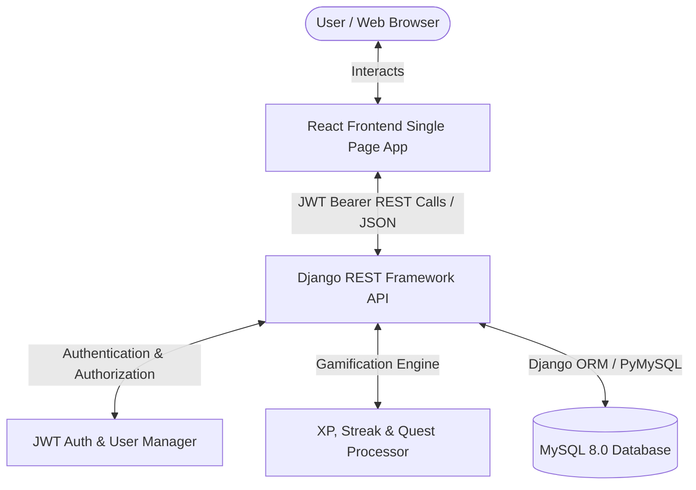


---

## 6. Database Design & ER Diagram

The MySQL database `track_my_spend` comprises 7 custom relational tables alongside Django's core authentication tables. Primary and foreign keys enforce referential integrity; unique constraints prevent duplicate records (for example, one budget per user per month).

| Table | Key Fields | Description |
|---|---|---|
| `users_user` | id (PK), email (UK), full_name, xp, level, rank_title, streak_days, last_expense_date | User authentication data and gamification profile |
| `expenses_expense` | id (PK), user_id (FK), amount, description, category, date, payment_method, notes | Individual expenditure entries |
| `expenses_budget` | id (PK), user_id (FK), month, amount — UNIQUE(user_id, month) | Monthly spending limit per user |
| `expenses_quest` | id (PK), code (UK), title, quest_type, target_count, xp_reward, icon, order | Master definition of daily / weekly / milestone quests |
| `expenses_userquest` | id (PK), user_id (FK), quest_id (FK), current_count, is_completed, is_claimed | Per-user quest progress |
| `expenses_achievement` | id (PK), code (UK), title, badge_icon, xp_reward, requirement_type, target_value | Master definition of unlockable badges |
| `expenses_userachievement` | id (PK), user_id (FK), achievement_id (FK), unlocked_at | Badges unlocked per user, with timestamp |

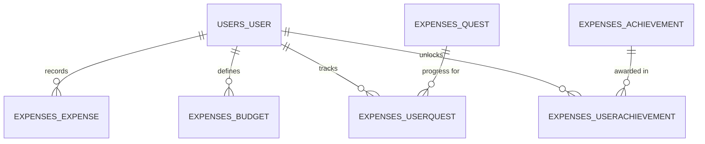


---

## 7. User Interface Layout & Screenshots

Key layout elements:

- **Navigation Sidebar** — responsive left-hand drawer with brand crest, navigation links with active indicators, user avatar and logout.
- **Top Navbar** — page title, sound toggle, active day-streak counter, level badge, theme switcher and "+ Add Expense" call to action.
- **Command Center (Dashboard)** — character card (level, rank, XP progress bar), 1-click quick-log presets, a 5-card financial metrics grid, budget progress bar and recent transactions.
- **Expense Ledger** — search, category pills, payment-method filter, date range, multi-attribute sorting, tabular view with totals and CSV export.
- **Add Expense** — category tile selector, payment-method pills, amount, date and optional notes.
- **Budget, Quests, Achievements and Profile** pages, each shown below with a matching screenshot.

### Login Page


### Register Page


### Dashboard — Dark Theme

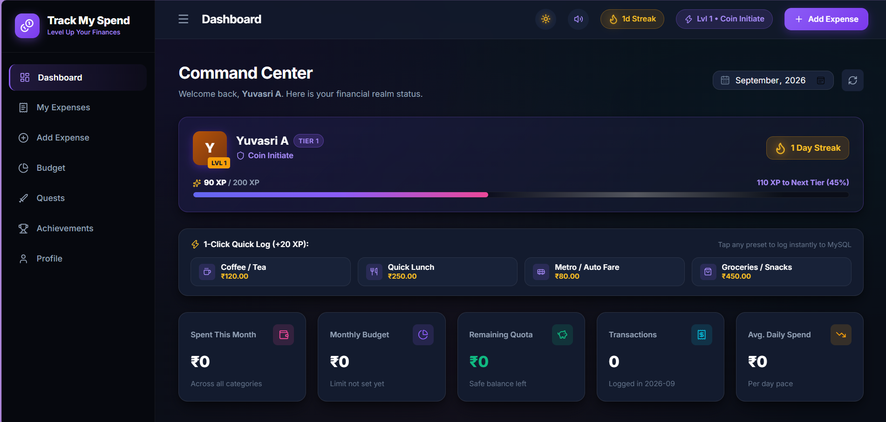

*Command Center dashboard — character card, quick-log presets, financial metrics and budget progress (dark theme)*

### Dashboard — Light Theme

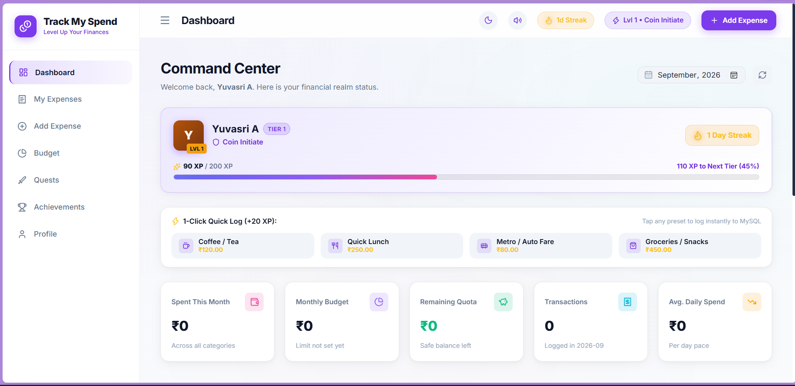

*Same dashboard shown in the light theme*

### My Expenses / Financial Ledger

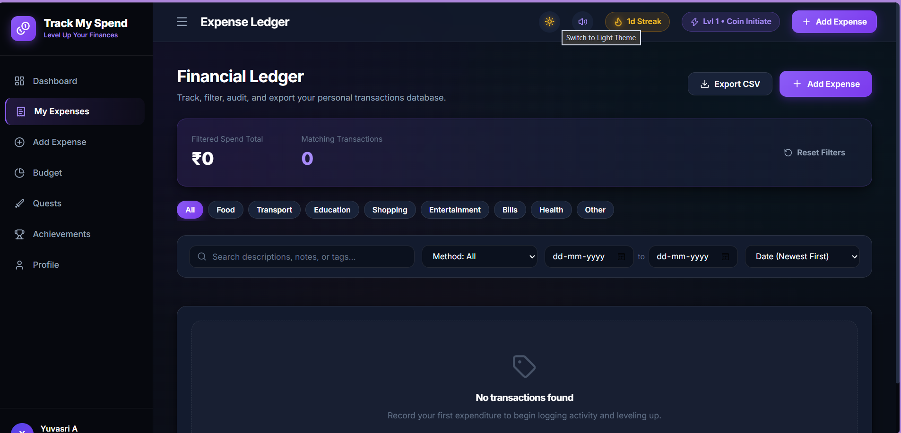

*Expense ledger with search, category and payment-method filters, date range and sorting*

### Add / Edit Expense Form

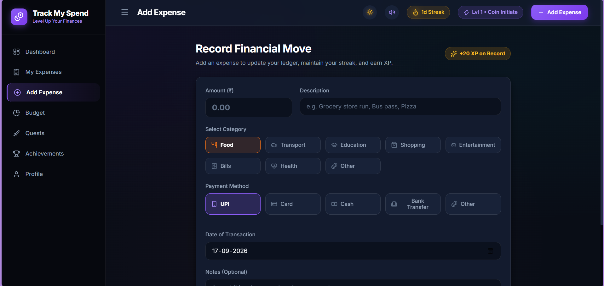

*Add Expense form with category tiles, payment-method pills and the "+20 XP on Record" badge*

### Budget Page

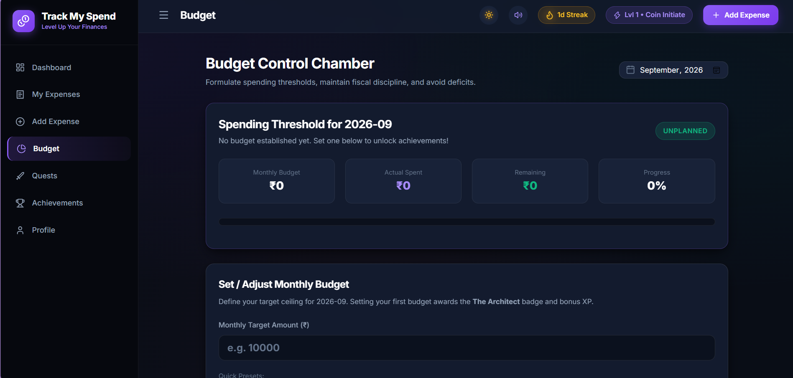

*Budget Control Chamber — monthly spending threshold and progress*

### Quests Page

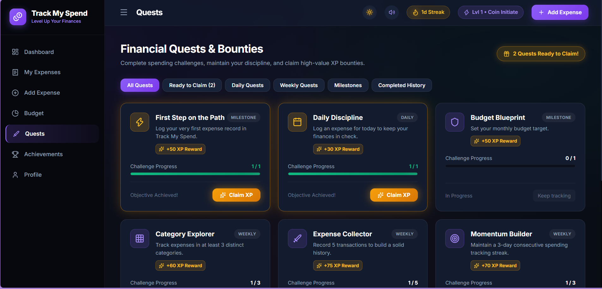

*Financial Quests & Bounties — daily, weekly and milestone quests with claimable XP*

### Achievements Page

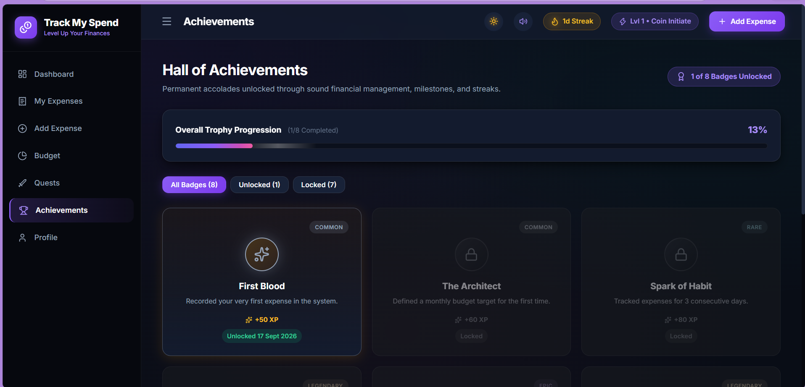

*Hall of Achievements — unlocked and locked badges with rarity tiers*

### Profile Page

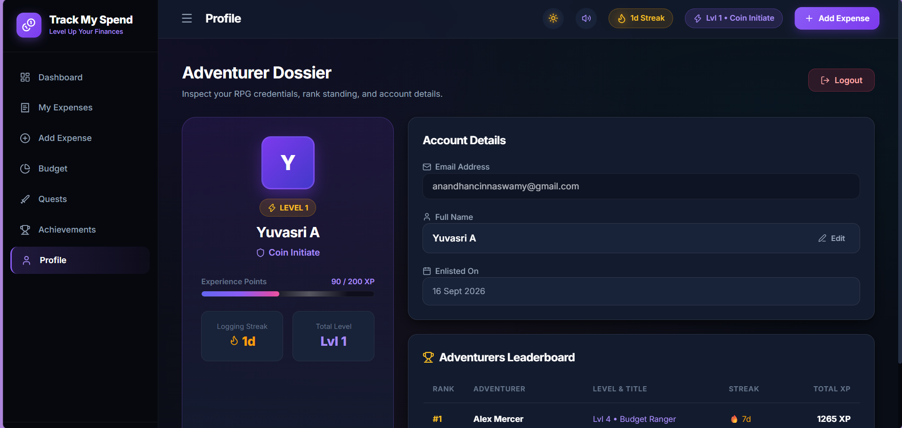

*Adventurer Dossier — account details and the global leaderboard*


---

## 8. REST API Endpoint Documentation

All endpoints return JSON. Protected routes require the header `Authorization: Bearer <jwt_access_token>`.

| Module | Method | Endpoint | Description |
|---|---|---|---|
| Auth | POST | `/api/auth/register/` | Register a new user (full name, email, password) |
| Auth | POST | `/api/auth/login/` | Authenticate; returns JWT access & refresh tokens |
| Auth | POST | `/api/auth/refresh/` | Refresh an expired access token |
| Auth | GET | `/api/auth/profile/` | Fetch the authenticated user's profile & RPG stats |
| Auth | PUT | `/api/auth/profile/` | Update the user's display name |
| Auth | GET | `/api/auth/leaderboard/` | Top users sorted by XP and streak |
| Expenses | GET | `/api/expenses/` | List expenses (search, category, date filters) |
| Expenses | POST | `/api/expenses/` | Create an expense; awards +20 XP, updates streak |
| Expenses | GET | `/api/expenses/{id}/` | Retrieve one expense record |
| Expenses | PUT | `/api/expenses/{id}/` | Update an expense record |
| Expenses | DELETE | `/api/expenses/{id}/` | Delete an expense record |
| Budget | GET | `/api/budget/?month=YYYY-MM` | Fetch the budget for a selected month |
| Budget | POST | `/api/budget/` | Set or update the monthly budget; awards a badge |
| Dashboard | GET | `/api/dashboard/stats/?month=YYYY-MM` | Aggregate monthly statistics & category breakdown |
| Quests | GET | `/api/quests/` | Fetch active quests and progress |
| Quests | POST | `/api/quests/{id}/claim/` | Claim a completed quest's XP reward |
| Badges | GET | `/api/achievements/` | List all badges with unlock timestamps |

---

## 9. CRUD Implementation Details

### 1. Create — Expense Record Creation

**Frontend:** the user submits the Add Expense form, or a 1-click quick preset. Form data is validated for a positive amount and a non-empty description, then dispatches `POST /api/expenses/`.

**Backend:** the serializer validates `amount > 0.01` and required fields; the Django ORM executes `Expense.objects.create(user=request.user, ...)`. A gamification hook then adds +20 XP, re-evaluates level tiers, updates the daily streak, increments quest counters and checks achievement milestones.

### 2. Read — Expense Retrieval & Querying

**Frontend:** the Ledger and Dashboard call `GET /api/expenses/` with query parameters (`search`, `category`, `payment_method`, `ordering`).

**Backend:** the Django ORM filters the queryset to the authenticated user only, applies the requested filters, and aggregates the total amount and transaction count for the summary cards.

### 3. Update — Expense Modification

**Frontend:** clicking Edit opens a pre-populated modal; on Save, a `PUT` request is sent to `/api/expenses/{id}/`.

**Backend:** the view confirms the record belongs strictly to the requesting user, updates it via the serializer, and returns the updated object; the ledger refreshes immediately.

### 4. Delete — Expense Removal

**Frontend:** clicking the trash icon prompts a confirmation dialog; on confirmation, a `DELETE` request is sent to `/api/expenses/{id}/`.

**Backend:** the record is removed from MySQL only after ownership is verified; the UI list and totals update immediately.

---

## 10. Validation, Testing & Results

### Client-side validation

- Non-empty validation for Description, Full Name and Email.
- Numeric range validation ensuring amount > ₹0.00.
- Password validation requiring a minimum length and matching confirmation password.
- Interactive error banners with friendly guidance, without page reloads.

### Server-side validation

- Serializer-level validation (`min_value = 0.01`) preventing negative or zero amounts.
- Case-insensitive email uniqueness check (`email__iexact`) at registration.
- Strict foreign-key scoping preventing one user from accessing another user's records (IDOR protection).
- Standard HTTP status codes: `400 Bad Request`, `401 Unauthorized`, `404 Not Found`, `500 Server Error`.

### Automated backend test suite

Implemented in `backend/expenses/tests.py` using Django REST Framework's `APITestCase` (`python manage.py test expenses`):

- `test_register_and_login` — verifies user creation, password hashing and JWT token issuance.
- `test_expense_crud` — verifies POST creation, GET listing, PUT modification and DELETE removal.
- `test_budget_and_dashboard` — verifies monthly budget calculation and remaining funds.
- `test_quests_and_achievements` — verifies gamification seeding and user progress tracking.

**Result:** `Ran 4 tests in 4.102s — OK` (100% pass).

### Frontend build & responsiveness

- `npm run build` — 1,905 modules transformed, built in 427ms, with 0 errors and 0 warnings.
- Desktop viewport (1440px): full sidebar, multi-column metric grid.
- Mobile viewport (375px): sidebar collapses to a slide-over drawer; summary grid becomes single-column.

### API testing evidence (Postman)

Sample authenticated requests exercised against the running backend:

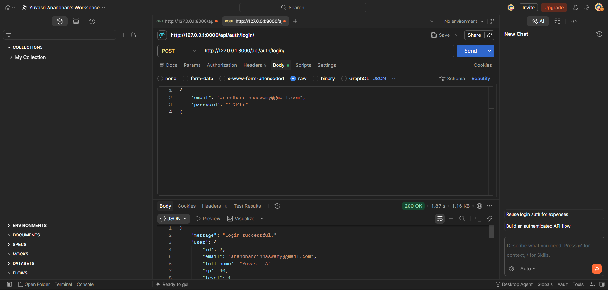

*POST /api/auth/login/ — 200 OK, JWT access & refresh tokens returned*

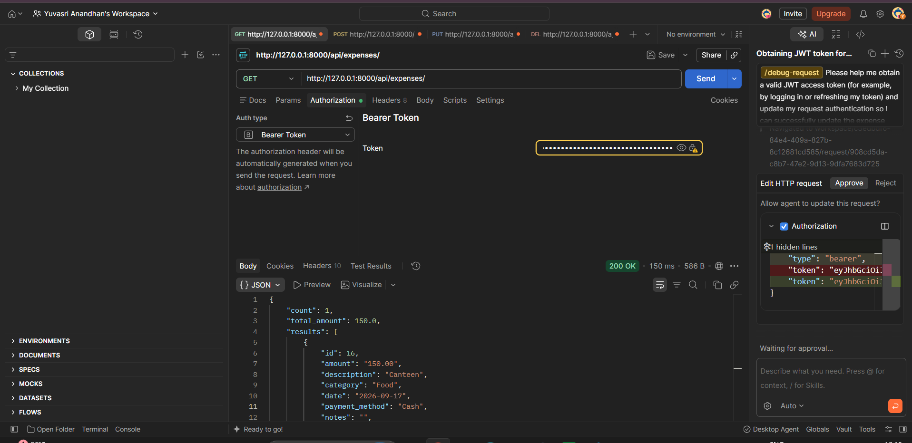

*GET /api/expenses/ — 200 OK, list with aggregated count and total_amount*

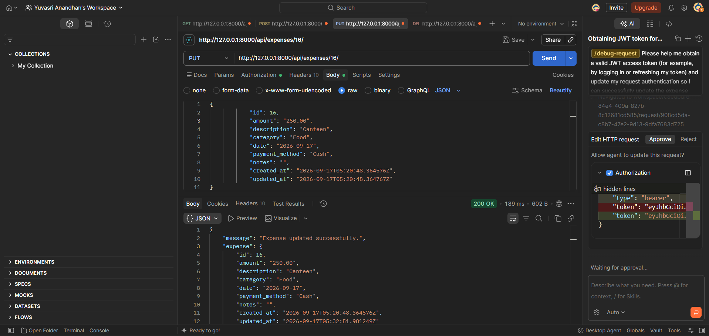

*PUT /api/expenses/{id}/ — 200 OK, expense updated successfully*

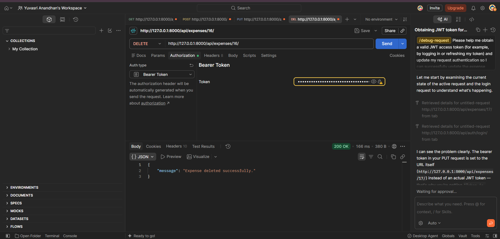

*DELETE /api/expenses/{id}/ — 200 OK, expense deleted successfully*

---

## 11. Security & Code Quality Guidelines

- **Environment separation:** sensitive credentials (`DB_PASSWORD`, `SECRET_KEY`) are kept exclusively in `.env` files, excluded from version control via `.gitignore`.
- **Password security:** passwords are hashed using Django's PBKDF2 with SHA-256; plaintext passwords are never stored.
- **SQL injection prevention:** exclusively Django ORM parameterised queries; raw concatenated SQL is avoided.
- **CORS policy:** `django-cors-headers` allows only the authenticated frontend origin and rejects unauthorised third-party requests.
- **Separation of concerns:** presentation logic (React components), API serialization (DRF serializers), business rules (gamification engine) and storage (MySQL) are fully decoupled.

---

## 12. Installation, Setup & Execution Guide

### Prerequisites

- Python 3.10+ installed
- Node.js 18+ and npm installed
- MySQL Server 8.0 running locally

### 1. Database setup

```sql
CREATE DATABASE IF NOT EXISTS track_my_spend CHARACTER SET utf8mb4 COLLATE utf8mb4_unicode_ci;
```

### 2. Backend setup

```bash
cd backend
pip install -r requirements.txt
python manage.py migrate
python manage.py seed_data
python manage.py create_demo_user
python manage.py runserver 127.0.0.1:8000
```

### 3. Frontend setup

```bash
cd frontend
npm install
npm run dev
```

Then open `http://localhost:5173` in a web browser.

### 4. One-click execution (VS Code / Windows)

Double-click `run_app.bat` in the project root to start both the backend and frontend servers in separate windows simultaneously.

### 5. Preloaded test account

Email: `ranger@trackmyspend.com` &nbsp;&nbsp; Password: `password123`
(or register a new account from the Register screen).

---

## 13. Challenges Faced & Solutions

| # | Challenge | Solution |
|---|---|---|
| 1 | **Django 6.x vs MySQL 8.0 incompatibility** — Django 6.0+ enforced a MySQL 8.4+ requirement, causing startup errors on standard MySQL 8.0.46 installs. | Used Django 5.2 LTS, which is fully, natively compatible with MySQL 8.0 while supporting all modern features. |
| 2 | **Windows MySQL C-extension compilation** — `mysqlclient` requires Microsoft Visual C++ Build Tools on Windows. | Used `pymysql` with `pymysql.install_as_MySQLdb()` in `config/__init__.py`, enabling pure-Python MySQL connectivity. |
| 3 | **Audio feedback without external assets** — external sound files add network latency and broken links. | Built a procedural synthesizer using the browser's native Web Audio API (`AudioContext`, oscillators, gain ramps) for instant, lightweight sound effects. |
| 4 | **Budget-overrun visibility** — standard trackers only show static spend amounts without urgency. | Implemented a colour-coded budget progress bar with a dynamic safe-daily-spend forecast and a dedicated alert banner. |

---

## 14. Future Enhancements

- **AI receipt scanner (OCR):** integrate Tesseract or Google Cloud Vision API to parse physical receipt images directly into expense entries.
- **Bank statement CSV import** with automatic categorisation.
- **Multi-currency and FX conversion** support for travel expenses.
- **Guilds / shared household budgets:** multi-user shared vaults for roommates or families, with split-bill mechanics.

---

## 15. Conclusion & College SOP Evaluation Compliance

Track My Spend comprehensively fulfils the requirements defined in the College Standard Operating Procedure for Complete CRUD-Based Web Application Development:

| SOP Evaluation Component | Weightage | Status |
|---|---|---|
| Requirement & Design | 10% | Fully met — clear problem definition, modular architecture, relational ER design with 7 tables. |
| Frontend Development | 20% | Fully met — responsive React UI, dark/light themes, form validation, icon system, audio feedback. |
| Backend / REST API | 20% | Fully met — Django REST Framework, JWT stateless authentication, serializers, custom managers. |
| CRUD Functionality | 20% | Fully met — complete Create, Read, Update and Delete with real-time MySQL persistence. |
| Database Design | 10% | Fully met — MySQL 8.0 schema, primary/foreign keys, unique constraints, migrations. |
| Testing & Quality | 10% | Fully met — automated test suite, 100% pass rate, input validation, error handling. |
| Documentation & Git | 10% | Fully met — project report, GitHub repository with atomic commits, run tasks. |
| **Total** | **100%** | **Compliant & production-ready** |

---

## 16. Git Repository & Reference Details

**GitHub Repository:** https://github.com/yuvasri93/Track-My-Spend-Expenditure-manager

Commit history, branches and the full source code are maintained in the repository above. A README with setup instructions is included at the project root.

### References

- Django Documentation — https://docs.djangoproject.com/
- Django REST Framework Documentation — https://www.django-rest-framework.org/
- React Documentation — https://react.dev/
- MySQL Documentation — https://dev.mysql.com/doc/
